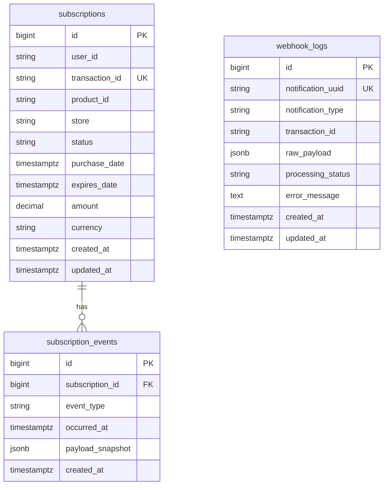
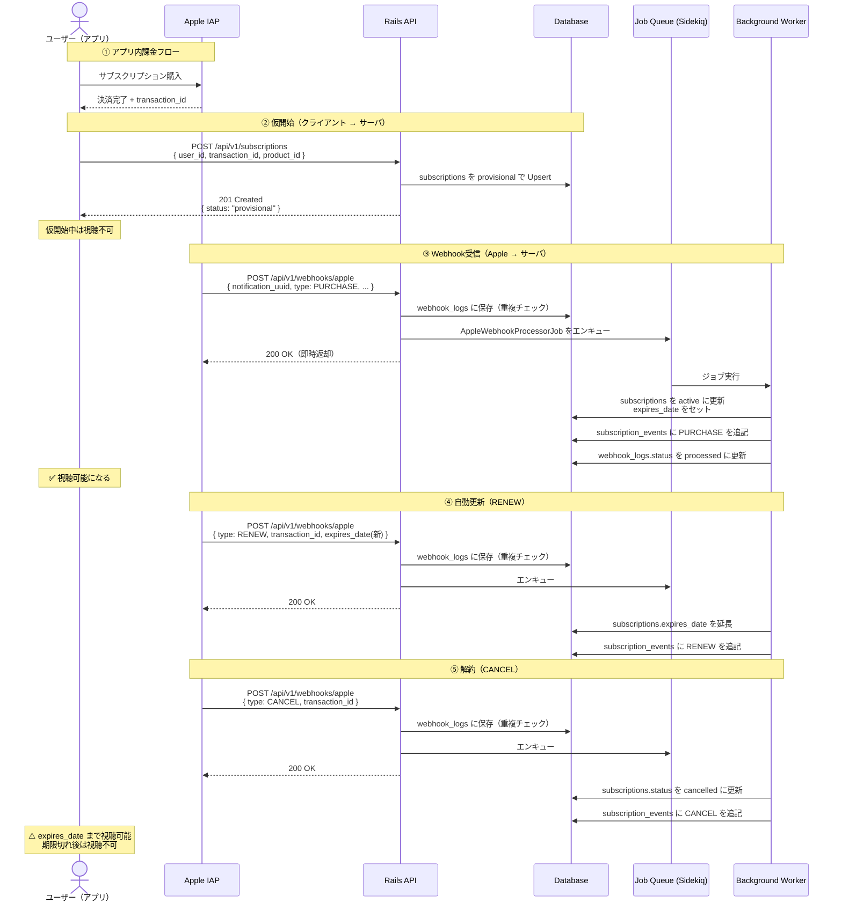
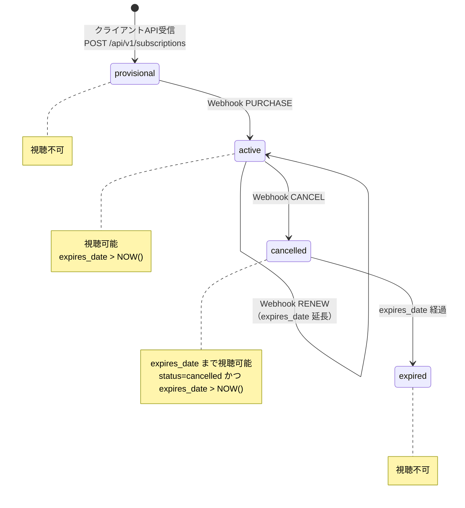
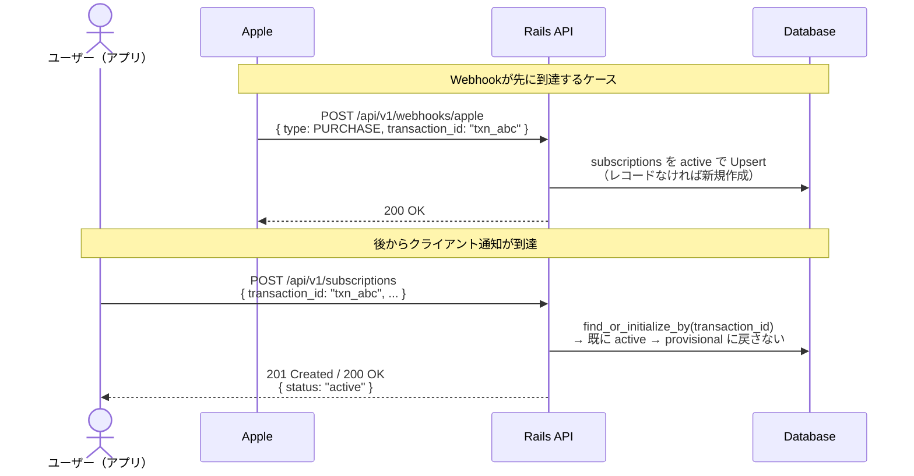
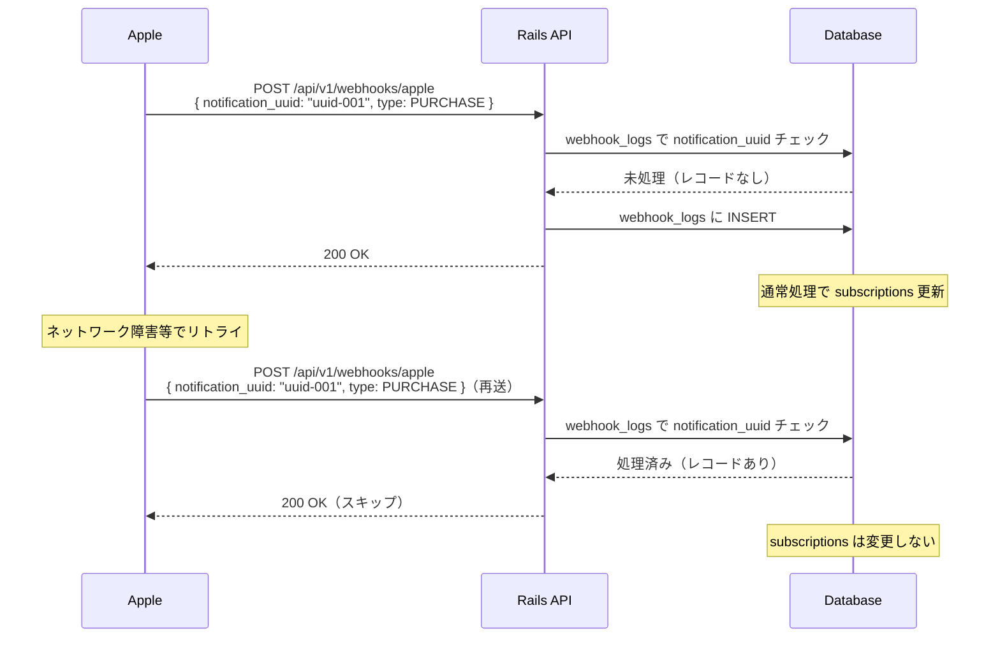

# 仕様書

## API インターフェース

### クライアント → サーバ（決済完了直後）

`POST /api/v1/subscriptions`

```json
{
  "user_id": "string",
  "transaction_id": "string",
  "product_id": "string"
}
```

| フィールド | 説明 |
|---|---|
| user_id | ユーザー識別子（今回はパラメータで受け取る、検証不要） |
| transaction_id | サブスクリプションを一意に識別する ID。自動更新されても同じ値 |
| product_id | サブスクリプションプランの ID（例: com.samansa.subscription.monthly） |

### Apple → サーバ（Webhook）

`POST /api/v1/webhooks/apple`

```json
{
  "notification_uuid": "string",
  "type": "PURCHASE | RENEW | CANCEL",
  "transaction_id": "string",
  "product_id": "string",
  "amount": "3.9",
  "currency": "USD",
  "purchase_date": "2025-10-01T12:00:00Z",
  "expires_date": "2025-11-01T12:00:00Z"
}
```

| フィールド | 説明 |
|---|---|
| notification_uuid | 通知ごとに一意の値（冪等性チェックに使用） |
| type | PURCHASE: 新規購入 / RENEW: 自動更新 / CANCEL: 解約 |
| transaction_id | サブスクリプションを一意に識別する ID |
| product_id | サブスクリプションプランの ID |
| amount / currency | 課金金額と通貨 |
| purchase_date | 現在のサブスクリプション期間の開始日時 |
| expires_date | 次回更新またはサブスクリプション終了日時 |

### サーバ → クライアント（視聴権限確認）

`GET /api/v1/users/:user_id/subscription`

```json
{
  "viewable": true,
  "status": "active",
  "expires_at": "2025-11-01T12:00:00Z"
}
```

| フィールド | 説明 |
|---|---|
| viewable | 視聴可否（`status IN ('active', 'cancelled') AND expires_date > NOW()`） |
| status | サブスクリプションの現在ステータス |
| expires_at | 有効期限（`cancelled` の場合は視聴可能期限） |

---

## データベーススキーマ

RDBMS は PostgreSQL を想定する。時刻はすべて `timestamptz`（UTC 保存）とする。

### ER 概要



### `subscriptions`

サブスクリプションの現在状態を表す。同一 `transaction_id` はアプリ内で一意（自動更新でも不変）。

| カラム | 型 | NULL | 説明 |
|---|---|---|---|
| `id` | `bigint` | NO | 主キー |
| `user_id` | `string` | NO | ユーザー識別子（API の `user_id` と同一） |
| `transaction_id` | `string` | NO | Apple 課金トランザクション ID（一意） |
| `product_id` | `string` | NO | プラン ID |
| `store` | `string` | NO | 課金ストア。既定値 `apple`（将来の Google Play 等の判別用） |
| `status` | `string` | NO | `provisional` / `active` / `cancelled` |
| `purchase_date` | `timestamptz` | YES | 現在の課金期間の開始（Webhook で更新） |
| `expires_date` | `timestamptz` | YES | 次回更新日または終了日時 |
| `amount` | `decimal(12, 4)` | YES | 直近通知の課金額（分析用） |
| `currency` | `string(3)` | YES | ISO 4217（例: USD） |
| `created_at` | `timestamptz` | NO | |
| `updated_at` | `timestamptz` | NO | |

**インデックス**

- `UNIQUE (transaction_id)`
- `INDEX (user_id)` — 視聴権限 API でのユーザー単位取得用

**備考**

- `expired` は DB に持たない。`expires_date` と現在時刻の比較で導出する（状態遷移図の `expired` は論理状態）。

### `webhook_logs`

受信した Apple Webhook の受付・冪等性・処理状態を記録する。`notification_uuid` で重複受信を検知する。

| カラム | 型 | NULL | 説明 |
|---|---|---|---|
| `id` | `bigint` | NO | 主キー |
| `notification_uuid` | `string` | NO | 通知ごとに一意（冪等キー） |
| `notification_type` | `string` | NO | `PURCHASE` / `RENEW` / `CANCEL`（JSON の `type` に対応） |
| `transaction_id` | `string` | YES | ペイロードから抽出。トラブルシュート用 |
| `raw_payload` | `jsonb` | NO | 受信ボディのスナップショット |
| `processing_status` | `string` | NO | 例: `pending` / `processed` / `failed` |
| `error_message` | `text` | YES | ジョブ失敗時のメッセージ |
| `created_at` | `timestamptz` | NO | |
| `updated_at` | `timestamptz` | NO | |

**インデックス**

- `UNIQUE (notification_uuid)`

### `subscription_events`

課金ライフサイクルのイベント履歴（分析・監査用）。`subscriptions` の現在値と併せて時系列を再構成できる。

| カラム | 型 | NULL | 説明 |
|---|---|---|---|
| `id` | `bigint` | NO | 主キー |
| `subscription_id` | `bigint` | NO | `subscriptions.id` への外部キー |
| `event_type` | `string` | NO | `PURCHASE` / `RENEW` / `CANCEL` |
| `occurred_at` | `timestamptz` | NO | イベント発生時刻（通常は Webhook の解釈時刻） |
| `payload_snapshot` | `jsonb` | YES | 当該通知の主要フィールドのコピー（任意。分析のしやすさ用） |
| `created_at` | `timestamptz` | NO | |

**インデックス**

- `INDEX (subscription_id, occurred_at)`

---

## 1. 全体シーケンス（正常系）



---

## 2. 状態遷移図



---

## 3. Webhook競合ケース（順序逆転）

> Webhookがクライアント通知より先に届いた場合の安全な処理フロー



---

## 4. 冪等性保証フロー（Webhook重複受信）


