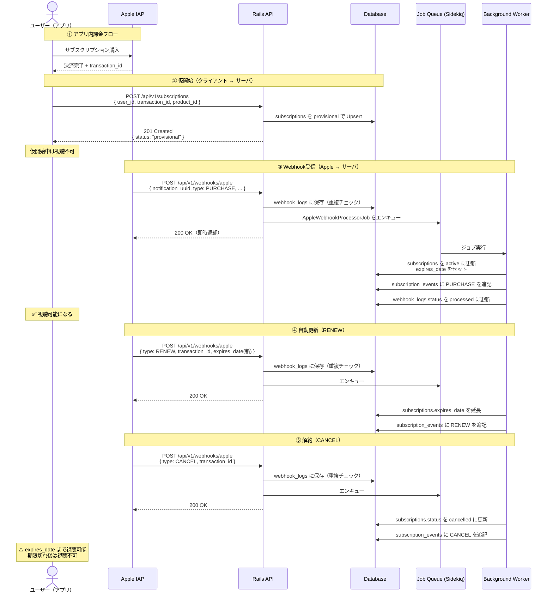
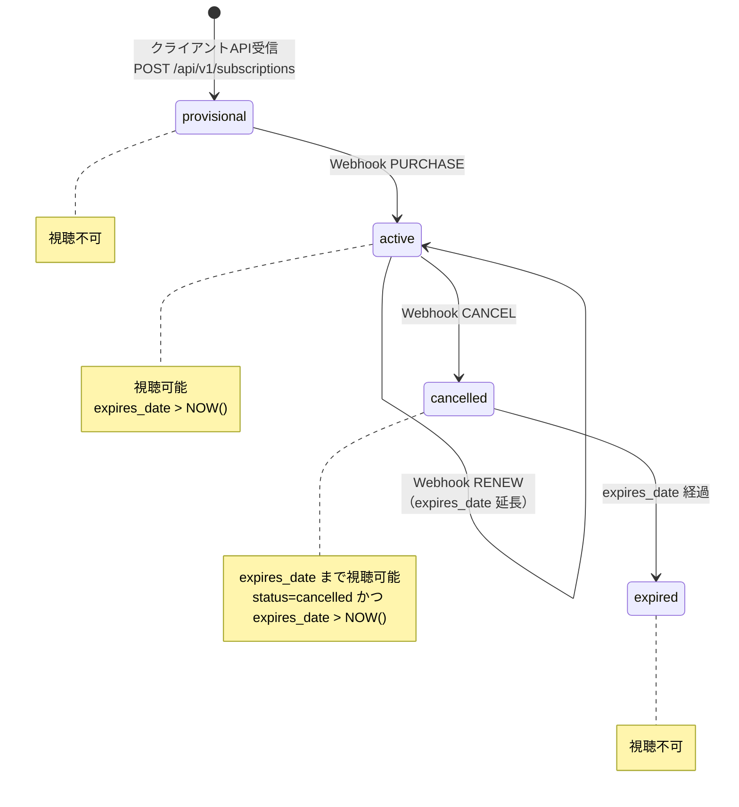
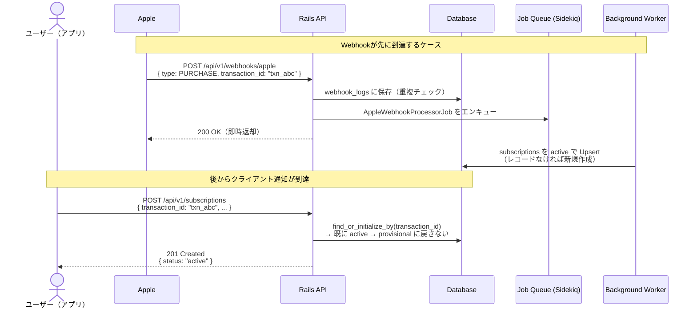
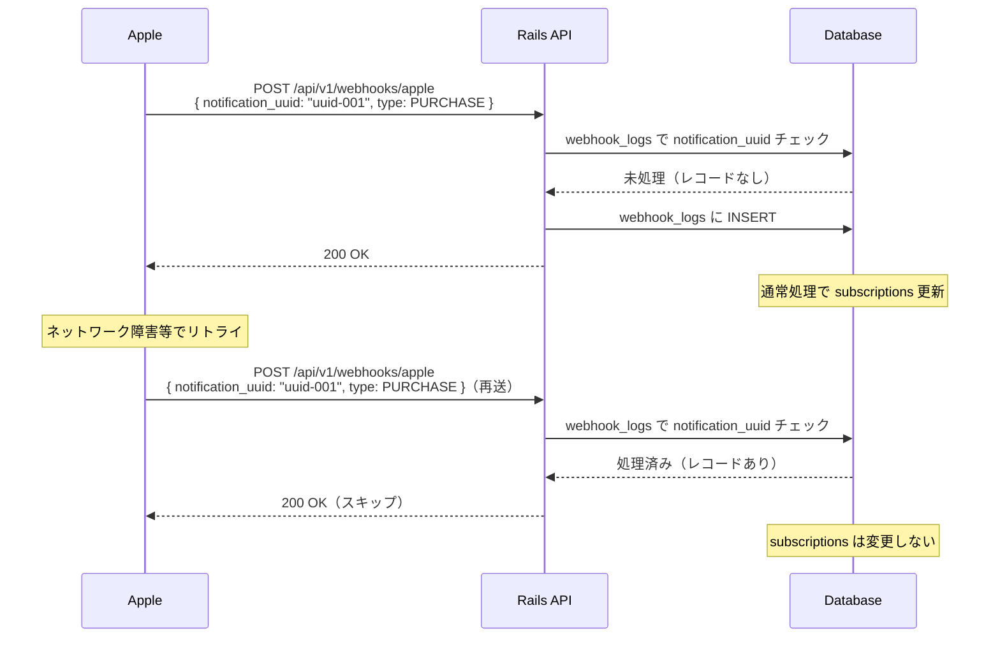

# 仕様書

## データベーススキーマ

RDBMS は PostgreSQL を想定する。

### ER 概要

```mermaid
erDiagram
  plans ||--o{ subscriptions : has
  subscriptions ||--o{ subscription_events : has

  plans {
    string product_id PK
    string name
    int billing_period_months
    decimal base_price
    string currency
    boolean active
    timestamptz created_at
    timestamptz updated_at
  }

  subscriptions {
    bigint id PK
    string user_id
    string transaction_id UK
    string product_id FK　b
    string store
    string status
    timestamptz expires_date
    timestamptz created_at
    timestamptz updated_at
  }

  subscription_events {
    bigint id PK
    bigint subscription_id FK
    string event_type
    timestamptz occurred_at
    decimal amount
    string currency
    timestamptz purchase_date
    timestamptz expires_date
    timestamptz created_at
  }

  webhook_logs {
    bigint id PK
    string notification_uuid UK
    string notification_type
    string transaction_id
    jsonb raw_payload
    string processing_status
    text error_message
    timestamptz created_at
    timestamptz updated_at
  }
```

### `plans`

プランのマスタテーブル。`product_id` を主キーとし、Apple に登録したサブスクリプションプランの情報を管理する。プランの追加はこのテーブルへのレコード挿入のみで対応でき、コード変更は不要。

| カラム | 型 | NULL | 説明 |
|---|---|---|---|
| `product_id` | `string` | NO | 主キー。Apple の product ID（例: `com.samansa.subscription.monthly`） |
| `name` | `string` | NO | 表示名（例: 月額プラン） |
| `billing_period_months` | `integer` | NO | 請求周期（月額=1, 年額=12） |
| `base_price` | `decimal(12, 4)` | NO | 標準価格 |
| `currency` | `string(3)` | NO | ISO 4217（例: USD） |
| `active` | `boolean` | NO | 販売中かどうか（廃止プランの論理削除用、既定値 `true`） |
| `created_at` | `timestamptz` | NO | |
| `updated_at` | `timestamptz` | NO | |

### `subscriptions`

ユーザーの現在の契約状態を保持する。視聴権限の判定にリアルタイムで参照するテーブル。課金額・請求期間の開始日時は `subscription_events` に委譲し、このテーブルは契約の「今の状態」だけを持つ。

| カラム | 型 | NULL | 説明 |
|---|---|---|---|
| `id` | `bigint` | NO | 主キー |
| `user_id` | `string` | NO | ユーザー識別子 |
| `transaction_id` | `string` | NO | Apple 課金トランザクション ID（一意） |
| `product_id` | `string` | NO | `plans.product_id` への FK |
| `store` | `string` | NO | 課金ストア。既定値 `apple`（将来の Google Play 等の判別用） |
| `status` | `string` | NO | `provisional` / `active` / `cancelled` |
| `expires_date` | `timestamptz` | YES | 次回更新日または終了日時（視聴権限判定に使用） |
| `created_at` | `timestamptz` | NO | |
| `updated_at` | `timestamptz` | NO | |

**インデックス**

- `UNIQUE (transaction_id)`
- `INDEX (user_id)` — 視聴権限 API でのユーザー単位取得用

**備考**

- `amount` / `currency` / `purchase_date` は持たない。プランの標準価格は `plans`、実際の課金履歴は `subscription_events` を参照する。
- `expired` は DB に持たない。`expires_date > NOW()` との組み合わせで動的に導出する。

### `webhook_logs`

受信した Apple Webhook の受付・冪等性・処理状態を記録する。`notification_uuid` で重複受信を検知する。

| カラム | 型 | NULL | 説明 |
|---|---|---|---|
| `id` | `bigint` | NO | 主キー |
| `notification_uuid` | `string` | NO | 通知ごとに一意（冪等キー） |
| `notification_type` | `string` | NO | `PURCHASE` / `RENEW` / `CANCEL`（JSON の `type` に対応） |
| `transaction_id` | `string` | YES | ペイロードから抽出。トラブルシュート用 |
| `raw_payload` | `jsonb` | NO | 受信ボディのスナップショット |
| `processing_status` | `string` | NO | 例: `pending` / `processed` / `failed` |
| `error_message` | `text` | YES | ジョブ失敗時のメッセージ |
| `created_at` | `timestamptz` | NO | |
| `updated_at` | `timestamptz` | NO | |

**インデックス**

- `UNIQUE (notification_uuid)`

### `subscription_events`

課金イベントの不変な履歴（分析・監査用）。Append-only で記録し、更新・削除は行わない。`subscriptions` は最新値で上書きされるため過去の請求履歴が消えるが、このテーブルで全イベントの時系列を保持する。

**利用例**: MRR（月次経常収益）算出・チャーン率分析・平均継続期間の算出・プラン別収益比較

| カラム | 型 | NULL | 説明 |
|---|---|---|---|
| `id` | `bigint` | NO | 主キー |
| `subscription_id` | `bigint` | NO | `subscriptions.id` への外部キー |
| `event_type` | `string` | NO | `PURCHASE` / `RENEW` / `CANCEL` |
| `occurred_at` | `timestamptz` | NO | イベント発生時刻（Webhook の `purchase_date` を使用） |
| `amount` | `decimal(12, 4)` | YES | イベント発生時点の課金額（CANCEL 時は NULL） |
| `currency` | `string(3)` | YES | ISO 4217（CANCEL 時は NULL） |
| `purchase_date` | `timestamptz` | YES | 当該課金期間の開始日時（CANCEL 時は NULL） |
| `expires_date` | `timestamptz` | YES | 当該課金期間の終了日時 |
| `created_at` | `timestamptz` | NO | |

**インデックス**

- `INDEX (subscription_id, occurred_at)` — サブスクリプション単位の時系列取得用

**備考**

- レコードの更新・削除は行わない。誤ったレコードが作成された場合は補正イベントを追記する。

---

## API インターフェース

クライアント向けと Apple Webhook 向けのエンドポイントを定義する。

### POST /api/v1/subscriptions

- **目的**: アプリ内課金完了直後に決済情報をサーバーへ送り、サブスクリプションを仮開始状態で登録する（Webhook 到着前の状態を記録する）。
- **呼び出し元**: クライアント（**初回購入時のみ**）
- **備考**: 
  - Apple Webhook だけで要件は満たせるが、①「決済完了済みだが Webhook 未着」という状態を DB に記録して運用・障害検知に活用する、②本来はここで Apple のレシート検証 API を叩いて `transaction_id` の正当性を確認する（本プロジェクトはスコープ外）、という2つの目的がある。
  - RENEW（自動更新）と CANCEL（解約）はユーザーが Apple の設定画面から操作し、Apple が直接 Webhook でサーバーに通知する。アプリがこのエンドポイントを叩くのは初回購入時の1回のみ。

**リクエストボディ**

```json
{
  "user_id": "string",
  "transaction_id": "string",
  "product_id": "string"
}
```

| フィールド | 説明 |
|---|---|
| user_id | ユーザー識別子（今回はパラメータで受け取る、検証不要） |
| transaction_id | サブスクリプションを一意に識別する ID。自動更新されても同じ値 |
| product_id | サブスクリプションプランの ID（例: com.samansa.subscription.monthly） |

### POST /api/v1/webhooks/apple

- **目的**: Apple からの購入確定・自動更新・解約の通知を受け取り、冪等キーで重複を排除したうえで後続処理（状態更新など）へ渡す。
- **呼び出し元**: Apple

**リクエストボディ**

```json
{
  "notification_uuid": "string",
  "type": "PURCHASE | RENEW | CANCEL",
  "transaction_id": "string",
  "product_id": "string",
  "amount": "3.9",
  "currency": "USD",
  "purchase_date": "2025-10-01T12:00:00Z",
  "expires_date": "2025-11-01T12:00:00Z"
}
```

| フィールド | 説明 |
|---|---|
| notification_uuid | 通知ごとに一意の値（冪等性チェックに使用） |
| type | PURCHASE: 新規購入 / RENEW: 自動更新 / CANCEL: 解約 |
| transaction_id | サブスクリプションを一意に識別する ID |
| product_id | サブスクリプションプランの ID |
| amount / currency | 課金金額と通貨 |
| purchase_date | 現在のサブスクリプション期間の開始日時 |
| expires_date | 次回更新またはサブスクリプション終了日時 |

### GET /api/v1/users/:user_id/subscription

- **目的**: コンテンツ視聴前に、当該ユーザーのサブスクリプションが視聴可能かを返す。
- **呼び出し元**: クライアント（動画再生前など）
- **呼び出しタイミング**:
  - アプリ起動時（コンテンツ一覧の視聴可否表示）
  - 動画再生ボタンタップ時（再生可否の最終判定）
  - 購入完了後のポーリング（Webhook 処理完了を待つ間）
- **レスポンスに応じたクライアントの挙動**:
  - `viewable: true` → 再生を許可する
  - `viewable: false` + `status: provisional` → 「決済処理中」を表示してポーリング継続
  - `viewable: false` + `status: cancelled` → 「有効期限が切れました」を表示して課金導線へ
  - `viewable: false` + `status: null`（サブスクリプションなし） → 課金導線へ

**レスポンスボディ（例）**

```json
{
  "viewable": true,
  "status": "active",
  "expires_at": "2025-11-01T12:00:00Z"
}
```

| フィールド | 説明 |
|---|---|
| viewable | 視聴可否（`status IN ('active', 'cancelled') AND expires_date > NOW()`） |
| status | サブスクリプションの現在ステータス。サブスクリプションが存在しない場合は `null` |
| expires_at | 有効期限（`cancelled` の場合は視聴可能期限）。サブスクリプションが存在しない場合は `null` |

---

## ワークフロー

### 1. 正常系課金フロー



---

## 2. 課金状態遷移



---

## 3. Webhook競合ケース（順序逆転）

> Webhookがクライアント通知より先に届いた場合の安全な処理フロー



---

## 4. 冪等性保証フロー（Webhook重複受信）


