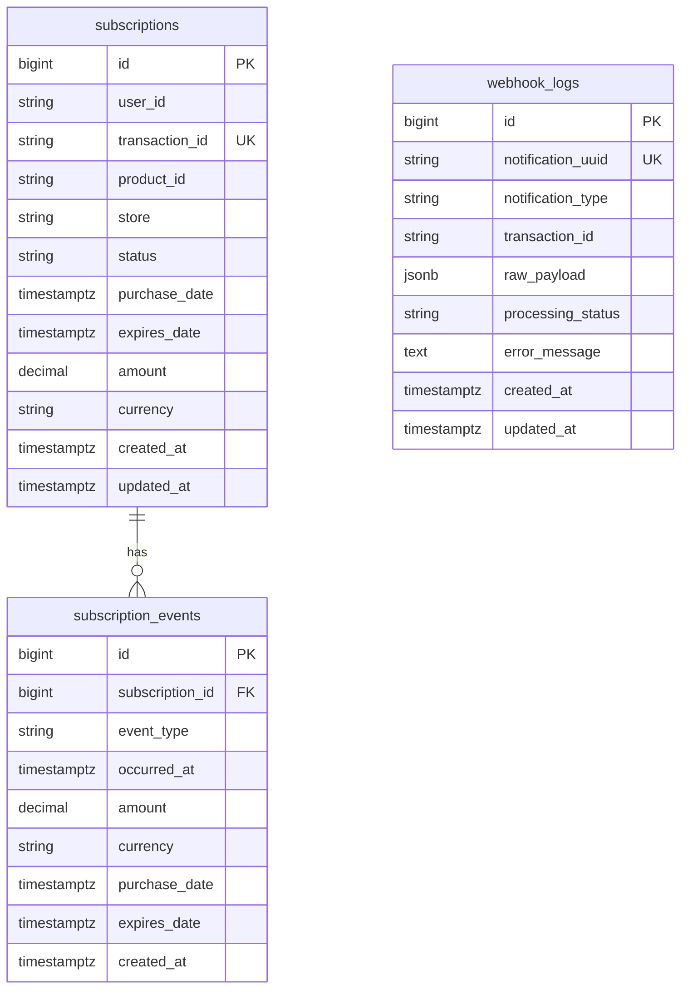
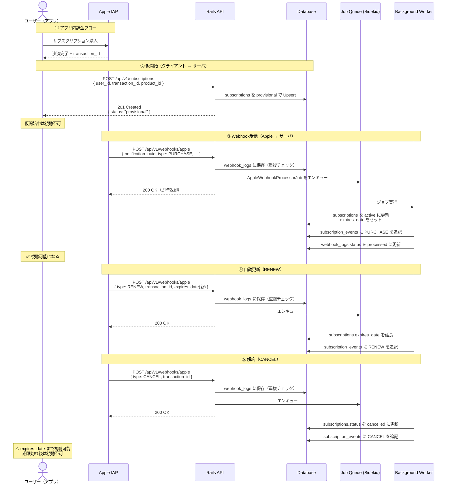
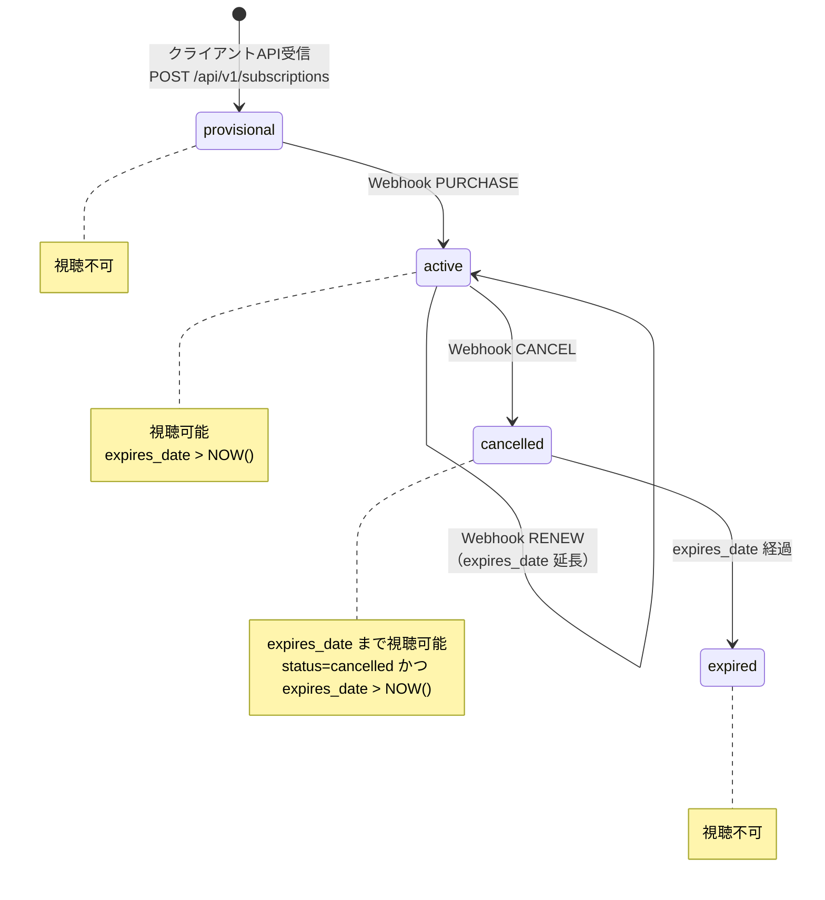
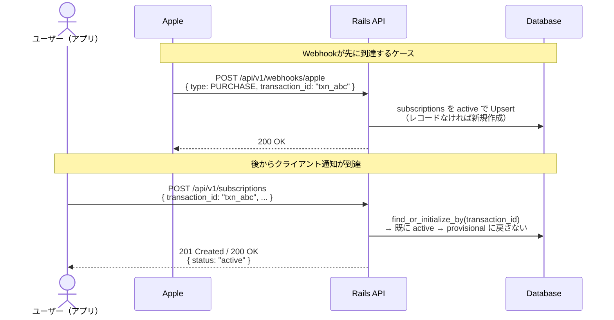
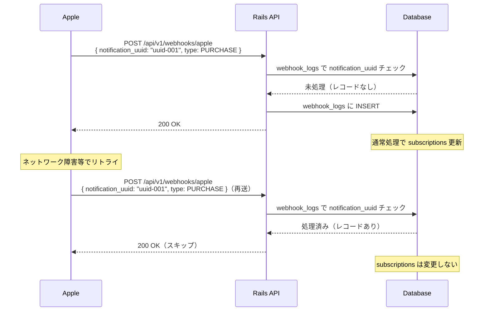

# 仕様書

## データベーススキーマ

RDBMS は PostgreSQL を想定する。時刻はすべて `timestamptz`（UTC 保存）とする。

### テーブルの役割分担

| テーブル | 役割 | 主な利用者 |
|---------|------|-----------|
| `subscriptions` | ユーザーの現在の契約状態（リアルタイム参照用） | アプリ（視聴権限チェック） |
| `subscription_events` | 課金イベントの不変な履歴（分析・監査用） | ビジネス分析（MRR・チャーン率等） |
| `webhook_logs` | Apple Webhook の受信ログ（冪等性・障害調査用） | 運用・デバッグ |

### ER 概要



### `subscriptions`

**役割**: ユーザーの現在の契約状態を保持する。アプリが視聴権限を判定する際にリアルタイムで参照するテーブル。Webhook を受信するたびに最新値で上書きされるため、常に「今の状態」を表す。

**利用例**:
- `GET /api/v1/users/:user_id/subscription` での視聴可否判定
- 管理画面での現在の契約状態確認

| カラム | 型 | NULL | 説明 |
|---|---|---|---|
| `id` | `bigint` | NO | 主キー |
| `user_id` | `string` | NO | ユーザー識別子（API の `user_id` と同一） |
| `transaction_id` | `string` | NO | Apple 課金トランザクション ID（一意） |
| `product_id` | `string` | NO | プラン ID |
| `store` | `string` | NO | 課金ストア。既定値 `apple`（将来の Google Play 等の判別用） |
| `status` | `string` | NO | `provisional` / `active` / `cancelled` |
| `purchase_date` | `timestamptz` | YES | 直近課金期間の開始日時（Webhook 受信時に上書き） |
| `expires_date` | `timestamptz` | YES | 次回更新日または終了日時（Webhook 受信時に上書き） |
| `amount` | `decimal(12, 4)` | YES | 直近通知の課金額（Webhook 受信時に上書き） |
| `currency` | `string(3)` | YES | ISO 4217（例: USD） |
| `created_at` | `timestamptz` | NO | |
| `updated_at` | `timestamptz` | NO | |

**インデックス**

- `UNIQUE (transaction_id)`
- `INDEX (user_id)` — 視聴権限 API でのユーザー単位取得用

**備考**

- `expired` ステータスは DB に持たない。`expires_date > NOW()` との組み合わせで動的に導出する。バッチ更新を不要にし、判定に時間的なラグが生じないようにするための設計判断。
- `amount` / `currency` / `purchase_date` / `expires_date` は最新値のみ保持する。過去の請求履歴は `subscription_events` を参照する。

### `subscription_events`

**役割**: 課金ライフサイクルのイベントを追記専用（Append-only）で記録する分析テーブル。`subscriptions` は最新状態を上書きするため過去の値が失われるが、このテーブルにより全イベントの時系列が保持される。

**利用例**:
- MRR（月次経常収益）の算出: 月別の PURCHASE / RENEW の `amount` を集計
- チャーン率の分析: 月別の CANCEL 件数を集計
- 平均継続期間の算出: PURCHASE から CANCEL までのイベント間隔を計算
- プラン別収益の比較: `product_id` と `amount` のクロス集計

| カラム | 型 | NULL | 説明 |
|---|---|---|---|
| `id` | `bigint` | NO | 主キー |
| `subscription_id` | `bigint` | NO | `subscriptions.id` への外部キー |
| `event_type` | `string` | NO | `PURCHASE` / `RENEW` / `CANCEL` |
| `occurred_at` | `timestamptz` | NO | イベント発生時刻（Webhook の `purchase_date` を使用） |
| `amount` | `decimal(12, 4)` | YES | イベント発生時点の課金額（CANCEL 時は NULL） |
| `currency` | `string(3)` | YES | ISO 4217（CANCEL 時は NULL） |
| `purchase_date` | `timestamptz` | YES | 当該課金期間の開始日時（CANCEL 時は NULL） |
| `expires_date` | `timestamptz` | YES | 当該課金期間の終了日時 |
| `created_at` | `timestamptz` | NO | |

**インデックス**

- `INDEX (subscription_id, occurred_at)` — サブスクリプション単位の時系列取得用

**備考**

- レコードの更新・削除は行わない。障害やリトライで誤ったレコードが作成された場合は補正イベントを追記する。
- `payload_snapshot jsonb` は持たない。生のペイロードが必要な場合は `webhook_logs.raw_payload` を参照する。

### `webhook_logs`

**役割**: Apple から受信した Webhook の生ログを記録する運用テーブル。主な目的は2つ。①`notification_uuid` によるべき等性の保証（同一通知の二重処理防止）、②Webhook 処理失敗時のトラブルシューティング。

**利用例**:
- 冪等性チェック: 受信時に `notification_uuid` の存在確認 → 重複受信をスキップ
- 障害調査: `processing_status = 'failed'` のレコードから `error_message` と `raw_payload` を確認
- 処理遅延の監視: `created_at` と `updated_at` の差分でジョブの処理時間を把握

| カラム | 型 | NULL | 説明 |
|---|---|---|---|
| `id` | `bigint` | NO | 主キー |
| `notification_uuid` | `string` | NO | 通知ごとに一意（冪等キー） |
| `notification_type` | `string` | NO | `PURCHASE` / `RENEW` / `CANCEL`（JSON の `type` に対応） |
| `transaction_id` | `string` | YES | ペイロードから抽出。障害調査時の検索用 |
| `raw_payload` | `jsonb` | NO | 受信ボディ全体のスナップショット |
| `processing_status` | `string` | NO | `pending`（受信直後）/ `processed`（処理完了）/ `failed`（エラー） |
| `error_message` | `text` | YES | ジョブ失敗時のエラーメッセージ |
| `created_at` | `timestamptz` | NO | Webhook 受信日時 |
| `updated_at` | `timestamptz` | NO | 処理ステータス更新日時 |

**インデックス**

- `UNIQUE (notification_uuid)` — 冪等性チェックの高速化

---

## API インターフェース

クライアント向けと Apple Webhook 向けのエンドポイントを定義する。

### POST /api/v1/subscriptions

- **目的**: アプリ内課金完了直後に決済情報をサーバーへ送り、サブスクリプションを仮開始状態で登録する（Webhook 到着前の状態を記録する）。
- **呼び出し元**: クライアント

**リクエストボディ**

```json
{
  "user_id": "string",
  "transaction_id": "string",
  "product_id": "string"
}
```

| フィールド | 説明 |
|---|---|
| user_id | ユーザー識別子（今回はパラメータで受け取る、検証不要） |
| transaction_id | サブスクリプションを一意に識別する ID。自動更新されても同じ値 |
| product_id | サブスクリプションプランの ID（例: com.samansa.subscription.monthly） |

### POST /api/v1/webhooks/apple

- **目的**: Apple からの購入確定・自動更新・解約の通知を受け取り、冪等キーで重複を排除したうえで後続処理（状態更新など）へ渡す。
- **呼び出し元**: Apple

**リクエストボディ**

```json
{
  "notification_uuid": "string",
  "type": "PURCHASE | RENEW | CANCEL",
  "transaction_id": "string",
  "product_id": "string",
  "amount": "3.9",
  "currency": "USD",
  "purchase_date": "2025-10-01T12:00:00Z",
  "expires_date": "2025-11-01T12:00:00Z"
}
```

| フィールド | 説明 |
|---|---|
| notification_uuid | 通知ごとに一意の値（冪等性チェックに使用） |
| type | PURCHASE: 新規購入 / RENEW: 自動更新 / CANCEL: 解約 |
| transaction_id | サブスクリプションを一意に識別する ID |
| product_id | サブスクリプションプランの ID |
| amount / currency | 課金金額と通貨 |
| purchase_date | 現在のサブスクリプション期間の開始日時 |
| expires_date | 次回更新またはサブスクリプション終了日時 |

### GET /api/v1/users/:user_id/subscription

- **目的**: コンテンツ視聴前に、当該ユーザーのサブスクリプションが視聴可能かを返す。
- **呼び出し元**: クライアント（動画再生前など）

**レスポンスボディ（例）**

```json
{
  "viewable": true,
  "status": "active",
  "expires_at": "2025-11-01T12:00:00Z"
}
```

| フィールド | 説明 |
|---|---|
| viewable | 視聴可否（`status IN ('active', 'cancelled') AND expires_date > NOW()`） |
| status | サブスクリプションの現在ステータス |
| expires_at | 有効期限（`cancelled` の場合は視聴可能期限） |

---

## ワークフロー

### 1. 正常系シーケンス



---

## 2. 状態遷移



---

## 3. Webhook競合ケース（順序逆転）

> Webhookがクライアント通知より先に届いた場合の安全な処理フロー



---

## 4. 冪等性保証フロー（Webhook重複受信）


